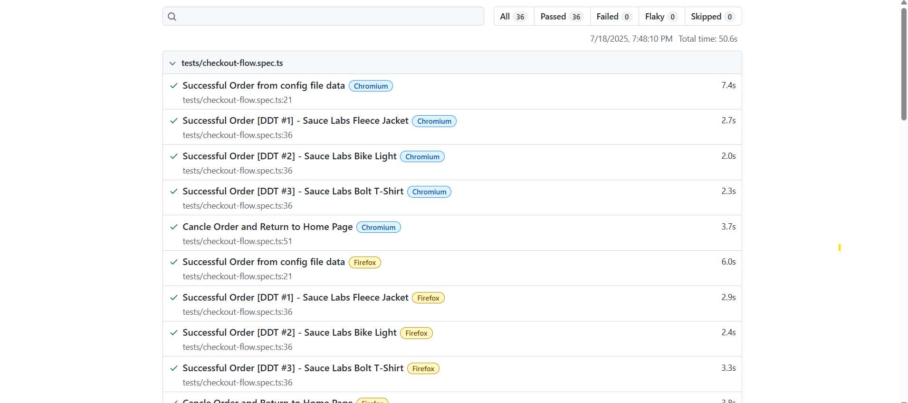

# Playwright E-Commerce Tests

This project is a UI automation framework built with [Playwright](https://playwright.dev/) and TypeScript.  
It tests the [saucedemo.com](https://www.saucedemo.com) e-commerce site using the Page Object Model (POM), with support for data-driven testing, config management, and HTML reporting.

## ✅ Features
- Page Object Model (POM) structure
- Data-driven tests using external JSON files
- Positive and negative login scenarios
- Full checkout flow with multiple data sets
- Sorting tests (price low to high, high to low)
- Cancel order and logout flows
- HTML test report via `npx playwright show-report`
- Config-driven base URL and credentials
## 🚀 CI Integration

This project is integrated with **GitHub Actions** for Continuous Integration.

Every time you push changes or create a pull request to the `main` branch, the following steps are automatically triggered:

- Code is checked out and dependencies are installed
- Playwright and required browsers are set up
- All tests are executed headlessly
- A full HTML report is generated
- The report is uploaded as an artifact to the GitHub Actions run

You can view the workflow under the [**Actions** tab](../../actions) of this repository.

## 🧪 Test Scenarios Covered
- Valid and invalid login attempts
- Add items to cart
- Checkout flow with dynamic user and product data
- Cancel order and return to homepage
- Product sorting validations

## 📁 Folder Structure
├── pages/ → Page object files
├── tests/ → Test specs (login, checkout, sorting, etc.)
├── test-data/ → JSON test data (orders.json, users.json)
├── utils/ → Config loader and helpers
├── config/ → appConfig.json (env settings)
├── SampleResult/ → Sample HTML report screenshot

## ▶️ How to Run Tests
Install dependencies:
```bash
npm install

Run all tests:
npx playwright test

Run a specific test file:
npx playwright test tests/login.spec.ts

Show HTML test report:
npx playwright show-report

📸 Sample HTML Report
Playwright generates an HTML report after each run using `npx playwright show-report`.  
To avoid committing auto-generated files, the actual report folder is excluded.

Instead, a sample screenshot is provided here:
- Folder: SampleResult/
- File: ReportSS1.png


💡 Notes
The test data is stored externally in test-data/ to support scalable data-driven testing.
The playwright-report/ folder is not committed — it is auto-generated on test run.
Tests are written to reflect real-world QA workflows with reusability and clarity in mind.

🧰 Tech Stack
Playwright
TypeScript
Node.js
JSON-based test data

👤 Author
Harshada Patil
QA Engineer | MSc in Applied CS & AI
